# แนวทางการทำงานร่วมกับ AI Agent (Agent Workflow Guidelines)

| Field | Value |
|:------|:------|
| **Version** | 1.0 |
| **Last Updated** | 2026-02-19T06:30:00+07:00 |
| **Purpose** | ป้องกันปัญหาทรัพยากรเครื่องไม่พอขณะ AI ทำงาน |

---

## ⚠️ ปัญหาที่พบ

เครื่องที่ใช้พัฒนามีข้อจำกัดด้าน RAM/CPU เมื่อ:
- **`npm run dev`** ทำงานอยู่ (Next.js dev server + Turbopack ใช้ RAM สูง)
- **AI Agent** ส่งคำสั่ง terminal พร้อมกันหลายตัว

**ผลลัพธ์:** ระบบค้าง, คำสั่งไม่ตอบ, ต้อง force kill แล้วเริ่มใหม่

---

## 📌 กฎสำหรับ AI Agent (ต้องปฏิบัติเสมอ)

### 1. ห้ามส่ง Terminal Command ขณะ Dev Server ทำงาน

```
❌ ห้าม: npm run dev ทำงานอยู่ + ส่งคำสั่ง terminal อื่น
✅ ถูกต้อง: ปิด dev server ก่อน → ส่งคำสั่ง → เปิด dev server ใหม่
✅ ถูกต้อง: ใช้ view_file / grep_search แทน terminal commands
```

### 2. ห้ามส่ง Terminal Command พร้อมกันมากกว่า 2 ตัว

```
❌ ห้าม: ส่ง 6 คำสั่ง Get-Content พร้อมกัน
✅ ถูกต้อง: ส่งทีละ 1-2 คำสั่ง หรือใช้ view_file แทน
```

### 3. ใช้ File-based Tools แทน Terminal เมื่อทำได้

| ต้องการ | ใช้ Tool นี้ (ไม่ใช้ terminal) |
|:---|:---|
| อ่านไฟล์ | `view_file` |
| ค้นหาข้อความ | `grep_search` |
| หาไฟล์ | `find_by_name` |
| ดูโครงสร้างไฟล์ | `view_file_outline` |
| ดูโฟลเดอร์ | `list_dir` |

### 4. Build Check ต้องปิด Dev Server ก่อน

```bash
# ขั้นตอนที่ถูกต้อง:
taskkill /F /IM node.exe    # ปิด dev server
npx next build              # ตรวจสอบ build
npm run dev                 # เปิด dev server กลับ
```

### 5. Seed Data / Test Data ใช้ Browser แทน Terminal

```
❌ ห้าม: ส่งคำสั่ง node scripts ขณะ dev server ทำงาน
✅ ถูกต้อง: สร้าง /seed page แล้วเปิดผ่าน browser
```

---

## 📋 ลำดับการทำงานที่แนะนำ

```mermaid
graph TD
    A[เริ่มงาน] --> B{dev server ทำงานอยู่?}
    B -- ใช่ --> C["ใช้ file tools เท่านั้น (view_file, grep_search)"]
    B -- ไม่ --> D[ส่ง terminal commands ได้ ทีละ 1-2 ตัว]
    C --> E{ต้องแก้ code?}
    E -- ใช่ --> F[แก้ไฟล์ แล้วให้ dev server hot-reload]
    E -- ไม่ --> G[จบงาน]
    D --> H{ต้อง build check?}
    H -- ใช่ --> I["ปิด dev server → npx next build → เปิดกลับ"]
    H -- ไม่ --> G
```



---

## 🔧 กรณีที่เครื่องค้าง

1. เปิด Task Manager (Ctrl+Shift+Esc)
2. หา process `node.exe` ที่ใช้ RAM สูง → End Task
3. ปิด VS Code แล้วเปิดใหม่
4. ถ้ายังค้าง: `taskkill /F /IM node.exe` ใน PowerShell

---
*เอกสารนี้สร้างขึ้นจากประสบการณ์จริงของ session 2026-02-17*
