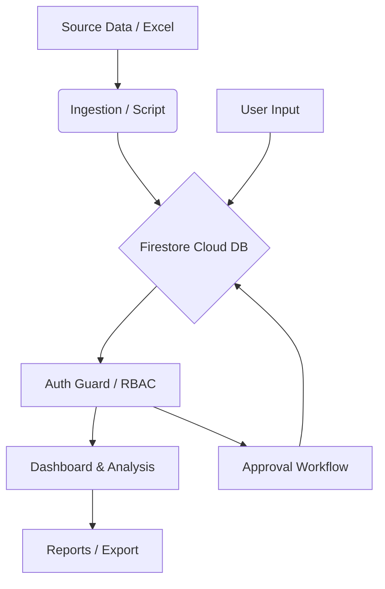

# KUVMIS Application Architecture & System Blueprint
# คณะสัตวแพทยศาสตร์ มหาวิทยาลัยเกษตรศาสตร์

| Field | Value |
|:------|:------|
| **Doc ID** | KUVMIS-DOC-001 |
| **Version** | 1.10 |
| **Standard** | ISO 27001 / EdPEx Compliance |
| **Last Updated** | 2026-02-23T19:45:00+07:00 |
| **Author** | KUVMIS Development Team |
| **Status** | Active |

---

## 1. ภาพรวมระบบ (System Overview)
**KUVMIS** (KU Veterinary Medicine Information System) คือระบบสารสนเทศเพื่อการจัดการสำหรับติดตาม KPI ตามมาตรฐาน EdPEx ครอบคลุม 61 KPI ใน 4 หมวด (7.1-7.4) โดยเน้นความง่ายในการใช้งาน ความปลอดภัยของข้อมูล และการวิเคราะห์แนวโน้มเพื่อการตัดสินใจ

---

## 2. Technology Stack
ระบบสร้างขึ้นด้วยเทคโนโลยีสมัยใหม่ (Modern Stack) ดังนี้:

| Layer | Technology | หน้าที่ |
|-------|-----------|--------|
| **Framework** | Next.js (App Router) | การจัดโครงสร้างหน้าเว็บและ Server-side Logic |
| **Style** | Tailwind CSS 4.x | การออกแบบ UI แบบ Premium และ Responsive |
| **Charts** | Chart.js | การแสดงผลข้อมูลในรูปแบบกราฟเชิงวิเคราะห์ |
| **DB / Auth** | Firebase (Firestore/Auth) | ฐานข้อมูล Cloud และระบบยืนยันตัวตน Google |
| **Export** | SheetJS | ระบบส่งออกข้อมูลเป็น Excel และ CSV |

---

## 3. รายการฟีเจอร์หลัก (Key Features)

### 3.1 ระบบ Dashboard การบริหาร
- **Executive Dashboard**: สรุปภาพรวม KPI Pulse (บรรลุเป้าหมาย/ต่ำกว่าเป้าหมาย)
- **Category Dashboards**: แยกตามหมวด 7.1 (วิชาการ), 7.2 (โรงพยาบาล), 7.3 (บุคลากร), 7.4 (ยุทธศาสตร์)
- **Annual Report Dashboard**: รายงานสรุปผลการดำเนินงานประจำปีแบบเปรียบเทียบ

### 3.2 ระบบจัดการข้อมูลงานวิจัยและบุคลากร
- **Research Module**: ดึงข้อมูลจาก Scopus, NCBI และ ORCiD (Future) พร้อมระบบ Mapping
- **Student Module**: จัดการนิสิตบัณฑิตศึกษา (Profile, Education, Progress, Publications)
- **Import/Export**: ระบบนำเข้าข้อมูลจาก Excel/CSV อัจฉริยะ พร้อม Script แปลงไฟล์

---

## 4. โครงสร้างโมดูลสำคัญ (Core Modules)

### 4.1 ระบบยืนยันตัวตน (Authentication & Roles)
- **Google Sign-In**: บังคับใช้ Email Whitelist ในคอลเลกชัน `authorized_users` เท่านั้น
- **Role-Based Access Control (RBAC)**:
    - **User**: กรอกและดูข้อมูลของตนเอง
    - **Reviewer**: ตรวจสอบและอนุมัติ (Approve/Reject) ข้อมูล
    - **Admin**: จัดการผู้ใช้ ระบบความลับ และฐานข้อมูลทั้งหมด

### 4.2 Workflow การอนุมัติ (Approval Workflow)
ข้อมูลที่กรอกผ่านฟอร์มจะเข้าสู่วงจรดังนี้:
1. `pending`: รอการตรวจสอบ
2. `approved`: อนุมัติแล้ว (แสดงผลใน Dashboard)
3. `rejected`: ปฏิเสธ (ระบุเหตุผลและส่งกลับแก้ไข)
4. `deleted`: ลบข้อมูลแบบ Soft Delete (Audit Trail)

### 4.3 ระบบจัดการผู้ใช้และบันทึกเหตุการณ์ (Admin & Logs)
- **Admin Panel**: เพิ่ม/ลบ ผู้ใช้ และเปลี่ยนบทบาทได้จากหน้าเว็บ
- **Login Logs**: บันทึก IP Address, Geolocation (จังหวัด/ISP), และอุปกรณ์ที่ใช้งาน เพื่อความปลอดภัยตามมาตรฐาน ISO 27001

---

## 5. แผนผังการไหลของข้อมูล (Data Flow)

---

## 6. ความมั่นคงปลอดภัย (Security & Compliance)
- **ALCOA+ Standard**: ข้อมูลต้องระบุตัวตนได้ (Attributable), อ่านออก (Legible), เป็นปัจจุบัน (Contemporaneous), ต้นฉบับ (Original) และถูกต้อง (Accurate)
- **Environment Separation**: แยกข้อมูล Dev/Staging/Production อย่างเด็ดขาด
- **Audit Trails**: บันทึกทุกกิจกรรมสำคัญ (ใคร ทำอะไร เมื่อไหร่ อย่างไร) ลงใน Log ของระบบ

---

## 7. Roadmap การพัฒนา
- [x] Phase 1-8: Foundation, Auth, Workflow, Admin, Indexes (สำเร็จ)
- [ ] Phase 9: Firebase Storage (File Uploads)
- [ ] Phase 10: Automated SAR Report Generation

---
*ปรับปรุงล่าสุด: 23 ก.พ. 2569 — KUVMIS Project Governance Update*
