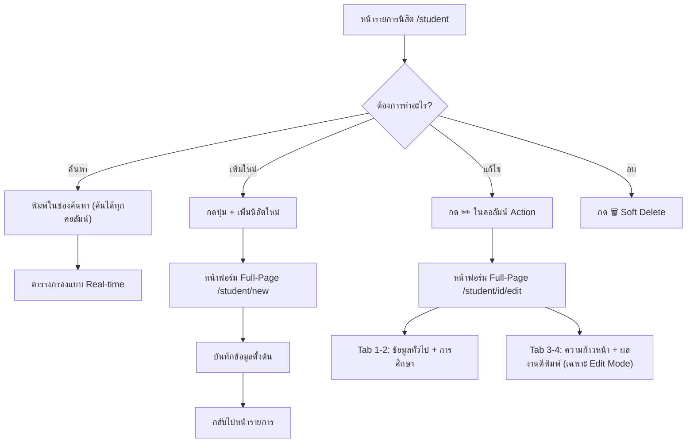

# การออกแบบระบบจัดการข้อมูลนิสิต (Student Data Management Design)

| Field | Value |
|:------|:------|
| **Doc ID** | KUVMIS-DOC-014 |
| **Version** | 1.03 |
| **Standard** | ISO 27001 / EdPEx Compliance |
| **Last Updated** | 2026-02-17T20:30:00+07:00 |
| **Author** | KUVMIS Development Team |
| **Status** | Released |

---

## 1. ผังการทำงาน (Workflow)

**Workflow หลัก** — ค้นหาจากตารางรายการ แล้ว Edit/Delete ผ่าน Action Column (เหมือน HR Module)

## 2. หน้าจอการใช้งาน

### 2.1 หน้ารายการ (/student) — เหมือนรูปแบบ HR Module

**แถบเครื่องมือ (Header)**
- ปุ่ม Back (ArrowLeft → Dashboard), ชื่อหน้า, ไอคอน
- Import dropdown (4 โหมด) + ปุ่มนำเข้า Excel
- ส่งออก (แสดงผล / ทั้งหมด)
- ปุ่ม: อาจารย์, รายงาน, เพิ่มนิสิตใหม่

**ช่องค้นหา** — ช่องเดียว ค้นได้ทุกคอลัมน์:
- รหัสนิสิต, ชื่อ-สกุล, สาขา, อาจารย์ที่ปรึกษา
- ภาควิชา, ระดับปริญญา, หลักสูตร, สถานะ

**View Tabs** — รายการปกติ / รายการที่ยกเลิก / ทั้งหมด

**ตาราง** — เรียงลำดับได้ (ID/Latest), Pagination (บน+ล่าง), Back to Top

**Action Column** — Edit + Delete (Soft Delete)

### 2.2 ฟอร์ม Full-Page (/student/new, /student/[id]/edit)

**Tab 1: ข้อมูลทั่วไป (Profile)**
- คำนำหน้า, ชื่อ-สกุล (ไทย/อังกฤษ), เพศ, สัญชาติ

**Tab 2: การศึกษา (Education)**
- ระดับปริญญา, หลักสูตร, สาขาวิชา (Autocomplete)
- อาจารย์ที่ปรึกษา (Autocomplete), ภาควิชา (Autocomplete)
- ปีเข้าศึกษา, ผลสอบภาษา, แผนการศึกษา
- หัวข้อวิทยานิพนธ์ (ไทย/อังกฤษ)
- กรรมการ, ปีที่คาดว่าจะจบ, ปีจบจริง

**Tab 3: ความก้าวหน้า (Milestones)** — *เฉพาะ Mode แก้ไข*
- ตาราง Milestones: QE, Proposal, Defense, English, Ethics ฯลฯ
- เพิ่ม/ลบรายการได้

**Tab 4: ผลงานตีพิมพ์ (Publications)** — *เฉพาะ Mode แก้ไข*
- ตารางผลงาน: ชื่อบทความ, วารสาร, ปี, Quartile, ฐานข้อมูล
- เพิ่ม/ลบรายการได้

## 3. หน้าจัดการอาจารย์ (/advisor)

UI ตามรูปแบบ HR Module:
- ปุ่ม Back → `/student`
- ตารางอาจารย์: รหัส, ชื่อ-สกุล, ภาควิชา, อีเมล
- Action: **👁️ ดูนิสิตในสังกัด** (ขยายแถว) + ✏️ Edit + 🗑️ Delete
- ช่องค้นหา, Pagination, Back to Top

## 4. ฐานข้อมูลที่เกี่ยวข้อง (Firebase Collections)

| Collection | คำอธิบาย | Key Field |
|:---|:---|:---|
| `graduate_students` | ข้อมูลนิสิต (Profile + Education) | `student_id` |
| `student_progress` | ความก้าวหน้าทางวิชาการ | `student_id` (FK) |
| `student_publications` | ผลงานตีพิมพ์ | `student_id` (FK) |
| `advisors` | ข้อมูลอาจารย์ที่ปรึกษา | `advisor_id` |

## 5. UI Components ที่สร้างใหม่

| File | คำอธิบาย |
|:---|:---|
| `hooks/useAutocomplete.ts` | Hook สำหรับดึงค่า distinct จาก Firestore field |
| `components/ui/AutocompleteInput.tsx` | Component dropdown แสดง suggestions |
| `components/student/StudentForm.tsx` | ฟอร์มหลัก 4 tabs |
| `components/student/StudentProgress.tsx` | จัดการ milestones |
| `components/student/StudentPublications.tsx` | จัดการผลงานตีพิมพ์ |
| `services/advisorService.ts` | CRUD อาจารย์ + batch + distinct names |

---
*เอกสารปรับปรุงล่าสุด: v.1.03 (Student Module Phase I)*
