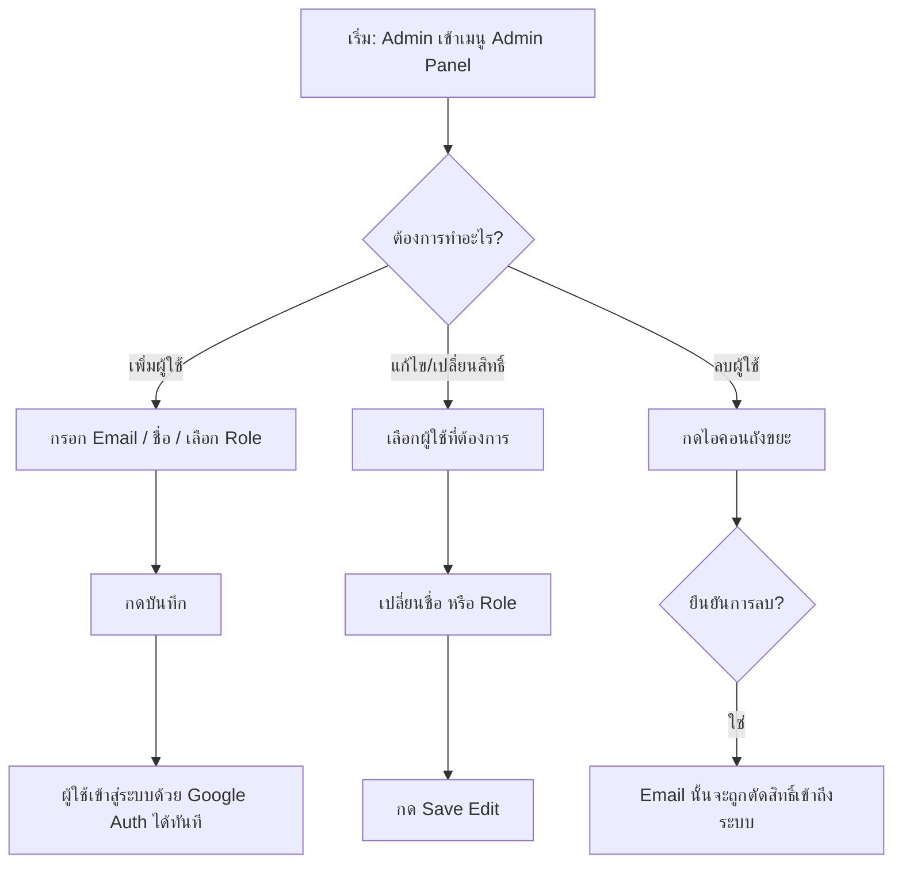
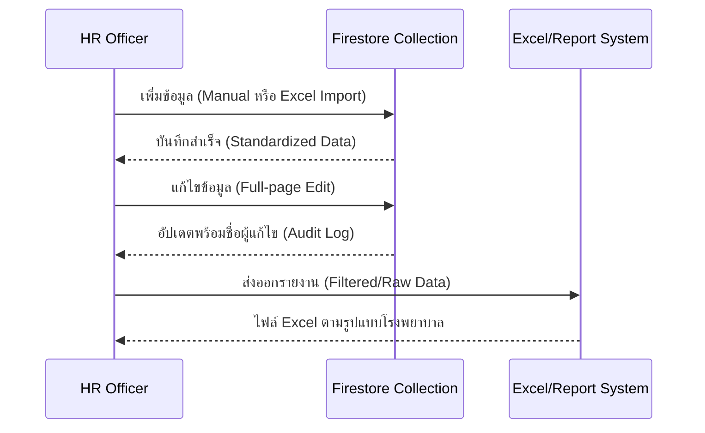
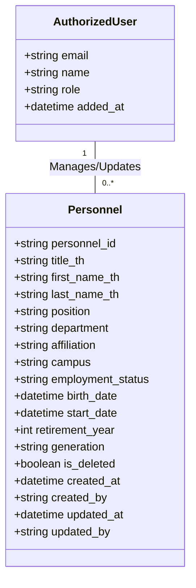

# คู่มือการใช้งานระบบ KUVMIS (v.1.02d)
## การจัดการผู้ใช้ และ ระบบบริหารงานบุคคล (HR Module)

| Field | Value |
|:------|:------|
| **Doc ID** | KUVMIS-DOC-012 |
| **Version** | 1.02d |
| **Standard** | ISO 27001 / EdPEx Compliance |
| **Last Updated** | 2026-02-16T19:25:00+07:00 |
| **Author** | KUVMIS Development Team |
| **Status** | Released |

เอกสารฉบับนี้จัดทำขึ้นเพื่อเป็นคู่มือสำหรับผู้ดูแลระบบ (Admin) ในการบริหารจัดการผู้ใช้งาน และเจ้าหน้างานบุคคล (HR) ในการจัดการข้อมูลบุคลากรของคณะสัตวแพทยศาสตร์

---

## 1. การจัดการผู้ใช้งาน (User Management)

ระบบจัดการผู้ใช้ช่วยให้ Admin สามารถควบคุมการเข้าถึงระบบผ่าน Email (KU Account) โดยแบ่งสิทธิ์การใช้งานตามภาระหน้าที่

### 1.1 ลำดับสิทธิ์การเข้าใช้งาน (Roles)
| สิทธิ์ (Role) | คำอธิบาย |
|:---:|:---|
| **User** | กรอกข้อมูล KPI, ดู Dashboard ทั่วไป |
| **Reviewer** | ตรวจสอบข้อมูล KPI, ดู Dashboard เชิงลึก |
| **Admin** | จัดการผู้ใช้, จัดการข้อมูล Master Data (Personnel), ลบข้อมูล |

### 1.2 แผนภูมิขั้นตอนการจัดการผู้ใช้ (User Management Flow)

### 1.3 การตรวจสอบประวัติการเข้าใช้งาน (Login Monitoring)
Admin สามารถตรวจสอบความปลอดภัยได้ผ่านแผงควบคุมประวัติ:
- **Real-time Logs**: ดูการเข้าใช้งานล่าสุด
- **Monthly Filter**: เลือกดูข้อมูลแยกตามรายเดือน
- **Export CSV**: ดาวน์โหลดรายงานการเข้าใช้งานรายเดือนเพื่อใช้ในการ Audit

---

## 2. ระบบบริหารงานบุคคล (Personnel & HR Module)

โมดูลนี้ใช้เพื่อจัดการข้อมูลพื้นฐานของบุคลากร ซึ่งเป็นฐานข้อมูลตั้งต้น (Master Data) สำหรับตัวชี้วัด EdPEx ต่างๆ

### 2.1 แผนภูมิวงจรข้อมูลบุคลากร (HR Data Lifecycle)

### 2.2 ขั้นตอนการจัดการข้อมูล (CRUD Operations)

#### ก) การเพิ่มบุคลากรรายบุคคล
1. เข้าเมนู **"ระบบบุคลากร (HR)"**
2. กดปุ่ม `+ เพิ่มบุคลากรใหม่`
3. กรอกข้อมูลแบ่งตามหมวดหมู่:
    - **ข้อมูลส่วนตัว**: รหัสบุคลากร, ชื่อ-สกุล (ภาษาไทย), เพศ, วันเกิด (ระบบจะคำนวณ Generation ให้อัตโนมัติ)
    - **การทำงาน**: ตำแหน่ง, สังกัด, วิทยาเขต, วันบรรจุ (ระบบจะคำนวณปีที่เกษียณให้อัตโนมัติ)
    - **วุฒิการศึกษา**: ระดับการศึกษาสูงสุด

#### ข) การแก้ไขข้อมูล (v.1.02d New Feature)
- สามารถกดปุ่ม **แก้ไข** (ไอคอนดินสอ) ในตาราง
- ระบบจะนำไปยังหน้า **Edit Page** แยกต่างหากเพื่อให้แก้ไขได้อย่างสะดวกและชัดเจน
- เมื่อบันทึกสำเร็จ ระบบจะเก็บชื่อผู้แก้ไข (Updated By) และเวลาที่แก้ไขไว้เสมอ

#### ค) การนำเข้าข้อมูลจำนวนมาก (Excel Import)
- เตรียมไฟล์ Excel ตามรูปแบบมาตรฐาน
- กดปุ่ม `Import Excel` และเลือกไฟล์
- ระบบจะทำการประมวลผลและแจ้งสรุปผลการนำเข้า (จำนวนสำเร็จ/ล้มเหลว)

---

## 3. โครงสร้างข้อมูลทางเทคนิค (Data Structure)

เพื่อให้เห็นภาพรวมของความสัมพันธ์ข้อมูล นี่คือแผนผัง Entity สำหรับ User และ Personnel:

---

## 4. มาตรฐานความถูกต้องของข้อมูล (ALCOA+)
ระบบถูกออกแบบมาให้รองรับมาตรฐานการตรวจสอบข้อมูล:
- **Traceability**: ทุกรายการมีฟิลด์ `created_by` และ `updated_by` เพื่อให้ทราบว่าใครเป็นผู้ทำรายการ
- **Persistence**: ใช้การลบข้อมูลแบบ **Soft Delete** (`is_deleted`) เพื่อป้องกันข้อมูลสูญหายจากความผิดพลาด
- **Standardization**: ข้อมูลวันที่ทั้งหมดถูกเก็บเป็น ISO Format และแสดงผลตามปฏิทินไทยเพื่อความถูกต้องในการรายงาน

---
*เอกสารปรับปรุงล่าสุดสำหรับเวอร์ชัน: **KUVMIS v.1.02d (Finish HR module phase I)***
