# คู่มือการใช้งานระบบ KUVMIS (v.1.03)
## ระบบจัดการข้อมูลนิสิตบัณฑิตศึกษา (Student Module)

| Field | Value |
|:------|:------|
| **Doc ID** | KUVMIS-DOC-013 |
| **Version** | 1.03 |
| **Standard** | ISO 27001 / EdPEx Compliance |
| **Last Updated** | 2026-02-17T20:30:00+07:00 |
| **Author** | KUVMIS Development Team |
| **Status** | Released |

เอกสารฉบับนี้จัดทำขึ้นเพื่อเป็นคู่มือสำหรับเจ้าหน้าที่บัณฑิตศึกษาในการจัดการข้อมูลนิสิต อาจารย์ที่ปรึกษา และผลงานทางวิชาการ

---

## 1. ภาพรวมหน้าจอ (Overview)

ระบบจัดการข้อมูลนิสิต ประกอบด้วย 3 ส่วนหลัก:
1. **หน้ารายการนิสิต** (`/student`) — ตารางแสดงข้อมูลนิสิตทั้งหมด
2. **หน้าเพิ่ม/แก้ไขนิสิต** (`/student/new`, `/student/[id]/edit`) — ฟอร์มกรอกข้อมูลนิสิตแบบ Full-Page
3. **หน้าจัดการอาจารย์ที่ปรึกษา** (`/advisor`) — ตารางจัดการข้อมูลอาจารย์

---

## 2. หน้ารายการนิสิต (/student)

### 2.1 แผนภูมิ Workflow หลัก

```mermaid
graph TD
    A[เข้าหน้ารายการนิสิต] --> B{ต้องการทำอะไร?}
    B -- ค้นหา --> C["พิมพ์ในช่องค้นหา (ค้นได้ทุกคอลัมน์)"]
    C --> D[ตารางแสดงผลลัพธ์แบบ Real-time]
    B -- เพิ่มนิสิตใหม่ --> E[กดปุ่ม เพิ่มนิสิตใหม่]
    E --> F[หน้าฟอร์ม Full-Page]
    B -- แก้ไข --> G[กดไอคอนดินสอ ในคอลัมน์ Action]
    G --> H[หน้าฟอร์ม Full-Page แบบ Edit]
    B -- ลบ Soft Delete --> I[กดไอคอนถังขยะ]
    I --> J{ยืนยันการลบ?}
    J -- ใช่ --> K[ย้ายไปรายการที่ยกเลิก]
    B -- นำเข้า Excel --> L[เลือกโหมดนำเข้า + กดปุ่ม นำเข้า Excel]
    B -- ส่งออก --> M["กดปุ่ม ส่งออก (แสดงผล/ทั้งหมด)"]
```

### 2.2 ช่องค้นหา (Search)
ช่องค้นหาเดียว ค้นได้ทุกคอลัมน์ที่แสดงในตาราง:
- รหัสนิสิต, ชื่อ-นามสกุล
- สาขาวิชา, รหัสสาขา
- อาจารย์ที่ปรึกษา, ภาควิชาของอาจารย์
- ระดับปริญญา (โท/เอก), หลักสูตร (ปกติ/พิเศษ)
- สถานะ (กำลังศึกษา/จบการศึกษา)

### 2.3 ตัวกรองดูข้อมูล (View Tabs)
| Tab | คำอธิบาย |
|:---|:---|
| **รายการปกติ** | แสดงนิสิตที่ยังไม่ถูกลบ |
| **รายการที่ยกเลิก** | แสดงนิสิตที่ถูก Soft Delete |
| **ทั้งหมด** | แสดงข้อมูลทั้งหมด |

### 2.4 ปุ่มในแถบเครื่องมือ
| ปุ่ม | ฟังก์ชัน |
|:---|:---|
| **นำเข้า Excel** | เลือกประเภท (ข้อมูลนิสิต / ผลงานตีพิมพ์ / ความก้าวหน้า / Smart Import) แล้วเลือกไฟล์ |
| **ส่งออก (แสดงผล)** | ส่งออก Excel เฉพาะที่กรองอยู่ |
| **ส่งออก (ทั้งหมด)** | ส่งออก Excel ทั้งหมดรวม Publications + Progress |
| **อาจารย์** | ไปหน้าจัดการอาจารย์ที่ปรึกษา |
| **รายงาน** | ไปหน้ารายงานสรุป |
| **เพิ่มนิสิตใหม่** | ไปหน้าฟอร์มเพิ่มนิสิต |

### 2.5 Pagination & Navigation
- Pagination แสดงด้านบนและด้านล่างตาราง
- ปุ่ม **Back to Top** ด้านล่างตาราง
- ปุ่ม **ย้อนกลับ** (ลูกศรซ้ายมุมบน) กลับหน้า Dashboard

---

## 3. ฟอร์มข้อมูลนิสิต (StudentForm)

### 3.1 โครงสร้าง Tabs
ฟอร์มแบ่งเป็น 4 Tabs:

| Tab | ข้อมูลที่กรอก | สถานะ |
|:---|:---|:---|
| **1. ข้อมูลทั่วไป** | คำนำหน้า, ชื่อ-สกุล (ไทย/อังกฤษ), เพศ, สัญชาติ | ใช้ได้เสมอ |
| **2. การศึกษา** | ระดับ, สาขา, อาจารย์ (Autocomplete), ปีเข้า, ผลสอบภาษา, วิทยานิพนธ์, กรรมการ, การสำเร็จ | ใช้ได้เสมอ |
| **3. ความก้าวหน้า** | ผลสอบ (QE, Proposal, Defense), Milestones ต่างๆ | เฉพาะ Mode แก้ไข |
| **4. ผลงานตีพิมพ์** | รายการผลงาน, วารสาร, Quartile, ฐานข้อมูล | เฉพาะ Mode แก้ไข |

> **หมายเหตุ:** Tab 3 และ 4 จะ active เฉพาะเมื่อแก้ไขนิสิตที่บันทึกแล้ว เพราะต้องมี `student_id` ในระบบก่อนจึงจะผูกข้อมูลย่อยได้

### 3.2 ระบบ Autocomplete
ฟิลด์ต่อไปนี้มี Autocomplete (แสดง Dropdown อัตโนมัติจากข้อมูลที่เคยกรอก):
- **อาจารย์ที่ปรึกษา** — ดึงจาก collection `graduate_students` (field: `advisor_name`)
- **สาขาวิชา** — ดึงจาก collection `graduate_students` (field: `major_name`)
- **ภาควิชา** — ดึงจาก collection `graduate_students` (field: `advisor_department`)

### 3.3 แผนภูมิวงจรข้อมูลนิสิต (Data Lifecycle)

```mermaid
sequenceDiagram
    participant Staff as เจ้าหน้าที่
    participant DB as Firestore Collections
    participant Report as Excel Report

    Staff->>DB: เพิ่มข้อมูล (Manual / Excel Import)
    DB-->>Staff: บันทึกสำเร็จ
    Staff->>DB: แก้ไขข้อมูล (Full-page Edit)
    DB-->>Staff: อัปเดตพร้อม Audit Log
    Staff->>DB: เพิ่มผลงานตีพิมพ์ / ความก้าวหน้า (Tab 3-4)
    DB-->>Staff: ผูกเข้ากับนิสิตอัตโนมัติ
    Staff->>Report: ส่งออกข้อมูล Excel
    Report-->>Staff: ไฟล์ Excel แยก Sheet
```

---

## 4. หน้าจัดการอาจารย์ที่ปรึกษา (/advisor)

### 4.1 ฟังก์ชันการทำงาน

| ปุ่ม/Action | คำอธิบาย |
|:---|:---|
| **เพิ่มอาจารย์ใหม่** | เปิดฟอร์มเพิ่มข้อมูลใหม่ (ชื่อ, รหัส, ภาควิชา, อีเมล) |
| **👁️ Eye (ดูนิสิต)** | ขยายแถว แสดงรายชื่อนิสิตในสังกัดของอาจารย์คนนั้น |
| **✏️ Edit** | แก้ไขข้อมูลอาจารย์แบบ Inline |
| **🗑️ Delete** | ลบข้อมูลอาจารย์ |
| **ช่องค้นหา** | ค้นหาจากชื่อ, รหัส, ภาควิชา, อีเมล |

### 4.2 Workflow การดูนิสิตในสังกัด

```mermaid
graph LR
    A[ตารางอาจารย์] --> B["กดปุ่ม 👁️ (Eye)"]
    B --> C["แถวขยาย แสดงรายชื่อนิสิต"]
    C --> D["แสดง: รหัส, ชื่อ, สาขา, สถานะ"]
    B --> E["กดซ้ำ = ย่อกลับ"]
```

---

## 5. การนำเข้าข้อมูล Excel (Import)

### 5.1 โหมดนำเข้า
| โหมด | คำอธิบาย |
|:---|:---|
| **ข้อมูลนิสิต (Profile)** | คอลัมน์: student_id, ชื่อ, เพศ, ระดับปริญญา, สาขา, อาจารย์ ฯลฯ |
| **ผลงานตีพิมพ์ (Publications)** | คอลัมน์: student_id, ชื่อบทความ, วารสาร, ปี, quartile |
| **ความก้าวหน้า (Progress)** | คอลัมน์: student_id, milestone_type, status, exam_date |
| **Smart Import** | รวมหลาย Sheet ในไฟล์เดียว |

### 5.2 ขั้นตอนการนำเข้า
1. เลือกโหมดนำเข้าจาก Dropdown
2. กดปุ่ม **นำเข้า Excel** แล้วเลือกไฟล์ (.xlsx, .xls)
3. ระบบจะประมวลผลและแสดงความคืบหน้า
4. สรุปผลการนำเข้า (จำนวนสำเร็จ/ล้มเหลว)

---

## 6. โครงสร้างข้อมูลทางเทคนิค (Data Structure)

---

## 7. มาตรฐานความถูกต้องของข้อมูล (ALCOA+)
ระบบถูกออกแบบมาให้รองรับมาตรฐานการตรวจสอบข้อมูล:
- **Traceability**: ทุกรายการมีฟิลด์ `created_by` และ `updated_by` เพื่อให้ทราบว่าใครเป็นผู้ทำรายการ
- **Persistence**: ใช้การลบข้อมูลแบบ **Soft Delete** (`is_deleted`) เพื่อป้องกันข้อมูลสูญหายจากความผิดพลาด
- **Standardization**: ข้อมูลวันที่ทั้งหมดถูกเก็บเป็น ISO Format

---
*เอกสารปรับปรุงล่าสุดสำหรับเวอร์ชัน: **KUVMIS v.1.03 (Student Module Phase I)***
